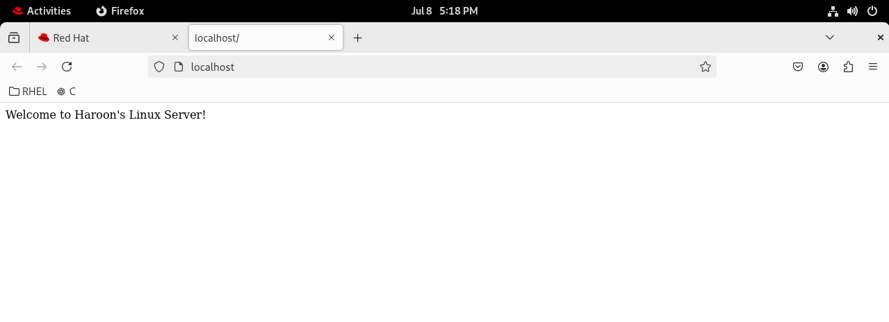
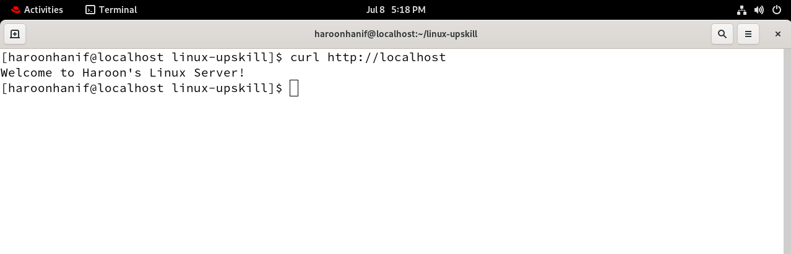

# Linux Sysadmin – Haroon Hanif

Welcome to my Linux learning journey. This repository documents hands-on tasks from the Linux Upskill Challenge and related practice projects.

---

## 📂 Sysadmin Portfolio Projects

| # | Task | Documentation | Script | Screenshot |
|---|------|---------------|--------|------------|
| 1 | 🌐 Apache Web Server Setup | [web_server_with_log_rotation.md](docs/web_server_with_log_rotation.md) | [apache_setup_with_log_rotation.sh](scripts/apache_setup_with_log_rotation.sh) | ,  |
| 2 | 🔐 SSH Authentication & Hardening | [ssh_authentication_hardening.md](docs/ssh_authentication_hardening.md) | [ssh_hardening.sh](scripts/ssh_hardening.sh) | ❌ |
| 3 | 🧪 Server Health Checker | [server_health_checker.md](docs/server_health_checker.md) | [server_health_check.sh](scripts/server_health_check.sh) | ❌ |
| 4 | 🧹 Cron Cleanup Script | [cron_cleanup.md](docs/cron_cleanup.md) | [cron_cleanup.sh](scripts/cron_cleanup.sh) | ❌ |
| 5 | 💾 Automated Backup Script | [automated_backup_solution.md](docs/automated_backup_solution.md) | [backup_mydata.sh](scripts/backup_mydata.sh) | ❌ |
| 6 | 👥 User & Group Management | [user_group_management.md](docs/user_group_management.md) | [manage_users.sh](scripts/manage_users.sh) | [user_mgmt_run.png](screenshots/user_mgmt_run.png) |
| 7 | 🔥 firewalld Setup & Automation | [firewalld_setup.md](docs/firewalld_setup.md) | [firewall_config.sh](scripts/firewall_config.sh) | [firewalld_status.png](screenshots/firewalld_status.png) |

---

🛠 All tasks are tested and documented with steps, scripts, and screenshots (where applicable).

